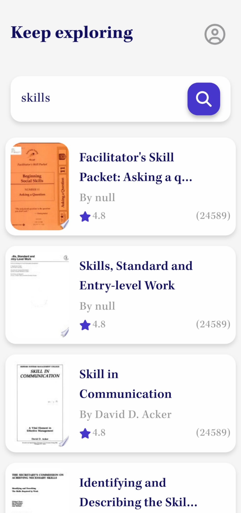

# zzzBookly - Soft Skills & Self Development Library

A Flutter application for discovering and exploring soft skills & self-development books using Google Books API. Search, preview, and manage your reading list with modern UI components and smooth animations.

   

## Features

- **Advanced Book Search**: Integrated SearchBooksCubit for efficient search operations
- **Smooth Navigation**: GoRouter implementation for seamless screen transitions
- **Rich Book Details**: Comprehensive book information with preview/download options
- **Trending Section**: Discover popular books with horizontal scroll
- **Cached Images**: Optimized image loading with CachedNetworkImage
- **Pull-to-Refresh**: RefreshIndicator for updating content
- **State Management**: BLoC/Cubit pattern for predictable state
- **Dependency Injection**: Clean architecture with get_it service locator
- **Error Handling**: Robust error management for API operations
- **Custom Animations**: Smooth splash screen transition

## Usage

- 🔍 **Search books** by title/author using the search bar  
- 📖 **Tap book covers** for detailed information  
- 🔄 **Pull down** to refresh content  
- 📥 **Download/preview** books through Google Books integration  

## API Integration

The app uses [Google Books API](https://developers.google.com/books) for:
- Fetching book metadata  
- Retrieving cover images  
- Accessing preview links  
- Download availability information  

## Tech Stack

- **Frontend**: Flutter  
- **State Management**: BLoC/Cubit  
- **Routing**: GoRouter  
- **Networking**: Dio  
- **Image Caching**: CachedNetworkImage  
- **DI**: get_it  
- **Localization**: Flutter Intl  
